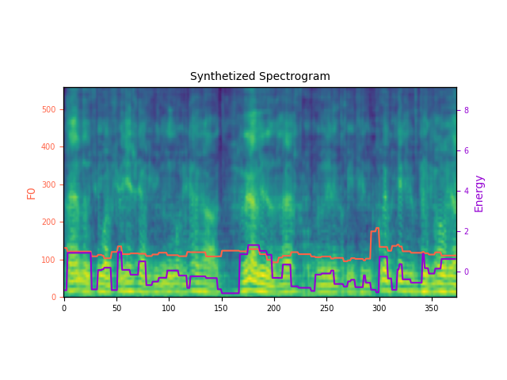
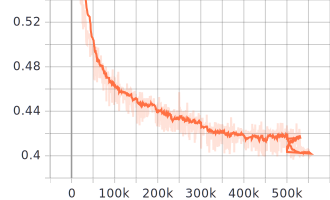

# High-Quality-Voice-Cloning

# Custom Model

This is a Custom Voice Cloning Model

<div align="center">
<a></a>
</div>

## Dependencies

You can install the Python dependencies with

```
pip3 install -r requirements.txt
```

# Config

Here are the config files used to train the single/multi-speaker TTS models.

- LibriTTS: suggested configuration for LibriTTS dataset.

Setup Your model.yaml, train.yaml and preprocess.yml before everything inside config

# Datset Splits

<table>
    <caption>Custom Dataset Split for Training, Validation, and Testing to fine-tune both Custom Models.</caption>
    <thead>
        <tr>
            <th>Dataset Split</th>
            <th>Audio Clips (.wav)</th>
        </tr>
    </thead>
    <tbody>
        <tr>
            <td>Total Dataset</td>
            <td>500</td>
        </tr>
        <tr>
            <td>Training Dataset</td>
            <td>350 (70%)</td>
        </tr>
        <tr>
            <td>Validation Dataset</td>
            <td>50 (10%)</td>
        </tr>
        <tr>
            <td>Test Dataset</td>
            <td>100 (20%)</td>
        </tr>
    </tbody>
</table>

# Preprocessing

```
python prepare_align.py config/{Your voice Dataset}/preprocess.yaml
```

to align the corpus and then run the preprocessing script - Followed by

```
python preprocess.py config/{Your voice Dataset}/preprocess.yaml
```

# Training

```
python3 train.py -p config/{Your voice Dataset}/preprocess.yaml -m config/{Your voice Dataset}/model.yaml -t config/{Your voice Dataset}/train.yaml
```

# Inference

You can download the [pretrained models] https://drive.google.com/drive/folders/1GCuMiniTQZHeTwHEgAo6dS9bQquvVDs5?usp=drive_link
and put them in output/ckpt/{Your voice Dataset}/

For vocoder,download pretrained from https://drive.google.com/drive/folders/1GCuMiniTQZHeTwHEgAo6dS9bQquvVDs5?usp=drive_link and put it in Hifi-Gan

```
python3 synthesize.py --text "YOUR DESIRED TEXT" --restore_step 900000 --mode single -p config/{Your voice Dataset}/preprocess.yaml -m config/{Your voice Dataset}/model.yaml -t config/{Your voice Dataset}/train.yaml
```

https://github.com/SiddantaK/High-Quality-Voice-Cloning/assets/101938746/18f762ac-a29d-44c0-86f8-bd69b0ee002d

# Cloned Outputs

Here you can listen the output of our cloned voice along with its ground truth audio.
https://drive.google.com/drive/folders/1FTqapXz9Z1kqtOPNUKaHX5GVVw0e7_8y?usp=sharing

<div align="center">
<a></a>
</div>
