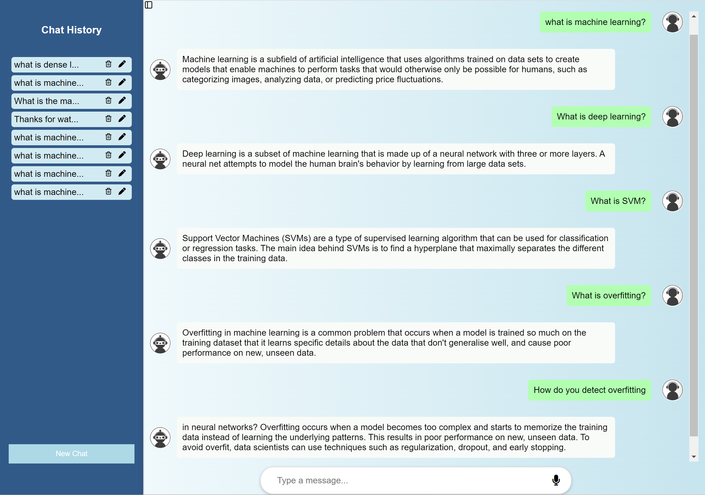
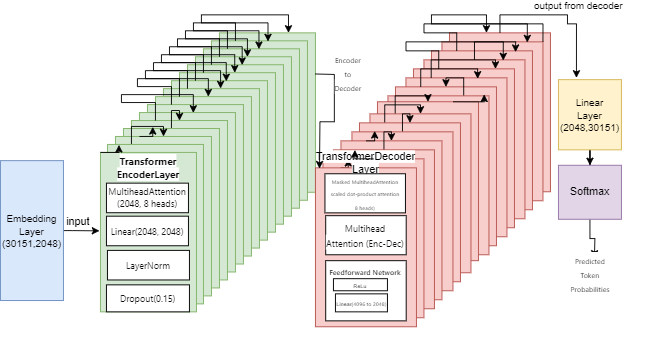
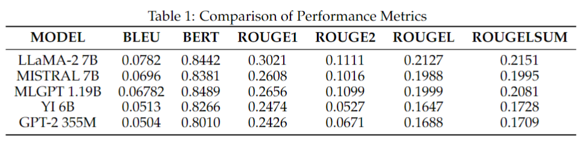
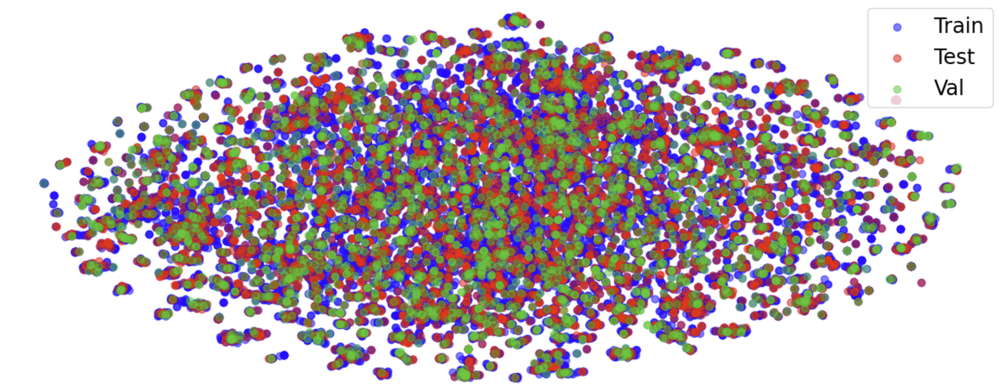

# MLGPT-C: Machine Learning Generative Pre-trained Transformer Chatbot 
This repository contains the code and resources for the MLGPT-C (Machine Learning Generative Pre-trained Transformer Chatbot) project, which was developed as part of a research endeavor to create an efficient and specialized chatbot for machine learning education and query resolution. 

# Project Overview 
The MLGPT-C project aims to address the limitations of existing question-answering language models in specialized domains, such as machine learning, by developing a novel transformer-based model trained on a curated dataset of machine learning questions and answers. The project comprises several key components: 
1. **MLQA Dataset**: A comprehensive dataset containing 26,550 pairs of machine learning questions and answers, carefully curated and cleaned. 
2. **MLGPT Model**: A custom transformer-based neural network model designed specifically for understanding and generating natural language responses related to machine learning concepts. 
3. **MLGPT-C Chatbot**: An interactive chatbot interface built using Flask, integrating the MLGPT model to facilitate conversational interactions with users through text and voice input/output. This research introduces an innovative question-answering chatbot, merging advanced natural language processing models (Llama2, Mistal, Yi, GPT-2) and NLP techniques. The project aims to enhance the understanding of complex machine learning concepts through an AI-driven, user-friendly platform. The system, built on a Flask backend architecture, seamlessly integrates models for efficient processing. The front-end interface, developed with HTML, CSS, and JavaScript, supports both text and voice inputs, enhancing accessibility. NLTK is employed for text preprocessing, enabling accurate responses to user queries. Preliminary results showcase the chatbot's high proficiency, generating context-sensitive responses with low validation loss. The dual-model approach ensures response diversity, effectively addressing a wide range of queries. This study not only bridges a gap in machine learning education but also lays the groundwork for future AI-driven educational resources, potentially revolutionizing AI education and enhancing students' comprehension of machine learning principles. 


The results of all models are as follows.

# Data 
The whole dataset contains about 26,550  questions and answers pairs about machine learning, and we split it randomly into a training dataset (70%), validation dataset (10%), and test dataset (20%). 3,000 QA pairs are picked from the dataset [[1]](#1), and 5,000 rows of question and answer pairs from SQuAD 2 [[2]](#2). The others are scraped from websites, such as Wiki and GeeksforGeeks. The tsne plot of the dataset is as follows.

# Model & Finetuning 
We used 5 different LLMs, which are Llama2-7b-chat, Mistral 7b, Yi-6b, GPT2, and our customized model. The llama2.ipynb (and other files named by models) is the code for finetuning.
 # Quick Get Start
### Installation instructions:
- **Hugging face Access Tokens:** Sign up and apply a [Hugging face Access Tokens](https://huggingface.co/settings/tokens)
- **Install necessary dependencies:** The python version needs to be 3.9. Please install necessary dependencies before running the code.
    ```
    pip install Flask transformers SpeechRecognition torch nltk scikit-learn datasets gTTS pandas
    ```
- **Modify path:** Modify the correct local path where the dataset and model are located in the [app1 file](https://github.com/YoushanZhang/AiAI/tree/main/Machine%20Learning%20Chat%20Robot%20for%20Students/app1.py).
- **Run the project:**
  - login Hugging face Access Tokens in WSL environment：
    ```
    huggingface-cli login --token XXXXX"     # change  "XXXXX" to your own Access Tokens
    ```
  - Run the code in WSL environment:
    ```
    python app1_3plus.py
    ```

## References
<a id="1">[1]</a> 
evang Kulshreshtha, Robert Belfer, Iulian Vlad Serban, and
Siva Reddy. Back-training excels self-training at unsuper-
vised domain adaptation of question generation and passage
retrieval, 2021

<a id="2">[2]</a> 
ranav Rajpurkar, Robin Jia, and Percy Liang. Know what
you don’t know: Unanswerable questions for squad, 2018.
